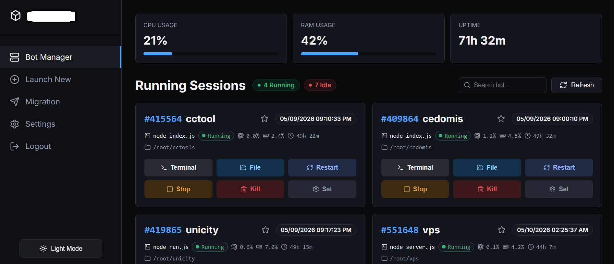

# VPS Bot Manager

A lightweight, modern web dashboard to manage, monitor, and deploy bot scripts on your VPS using GNU `screen`.




## ✨ Features

- **🚀 1-Click VPS Migration (Unique Feature):** Securely and seamlessly transfer your running bot scripts to a completely new VPS via SFTP. It automatically excludes heavy folders (`node_modules`, `.git`) and uses parallel sync for blazing-fast server transfers without needing manual zip files.
- **Bot Management:** Start, Stop, Kill, and Restart bots with 1-click. Includes Auto-Sort and Pin features.
- **Web Terminal:** Built-in WebSocket terminal (`xterm.js`) to view live logs and interact with bots.
- **File Explorer & IDE:** Browse folders, upload/delete files, and edit code directly in the browser using `Monaco Editor`.
- **Live System Stats:** Monitor CPU, RAM, and Uptime in real-time.
- **Dark & Light Mode:** Premium responsive UI with Theme support.

## 📋 Prerequisites

- **Node.js** v16.0 or higher
- **GNU Screen** installed on your VPS (`apt install screen`)
- **NPM** (Node Package Manager)

## 🚀 Installation

1. **Clone the repository:**
   ```bash
   git clone https://github.com/jimixz44/VPSMonitor.git
   cd VPSMonitor
   ```

2. **Install modules / dependencies:**
   ```bash
   npm install
   ```

3. **Start the application:**
   ```bash
   node server.js
   ```
   *(Or run it in the background using screen/pm2)*

4. **Access the Dashboard:**
   Open your browser and navigate to `http://your-vps-ip:3000`.

## 🔒 Security Note
This project uses SQLite (`database.sqlite`) to store credentials. The `.gitignore` file is configured to prevent it from being pushed to public repositories. **Never commit your database or `.env` files.**

## 📝 License
MIT License
